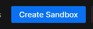
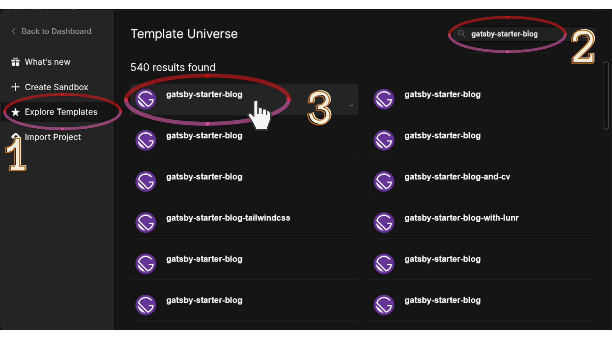

Hi! Hope you're having a good day and keeping safe.
As a part of the #100DaysOfCode challenge, I decided to create a blog to document my journey with the challenge.

This blog is built using GatsbyJS, and I learned the basics of Gatsby in a couple of days. If you know ReactJS, Gatsby is easy to catch on to.

Without further ado, let's dive into how you can develop a blog just like this for sharing your own thoughts and journeys.

### What is GatsbyJS?

Gatsby is a React-based open-source framework for creating websites and apps.

## What are starters in Gatsby?

To develop our blog we will be using the [gatsby-starter-blog starter](https://www.gatsbyjs.com/starters/gatsbyjs/gatsby-starter-blog), but what is a starter?

- It is a boilerplate Gatsby site that helps jump-start the development process.
- Starters are maintained by the community, for the community.

### System Prerequisites

You need to perform the following installations on your system before you begin with the development:

1. [Node.js](https://nodejs.org/en/download/): preferably the LTS version.
1. After you install Node.js, open your terminal or command prompt and install gatsby-cli using npm with the command

`npm install -g gatsby-cli`

1. To facilitate deployment and to make your repository on GitHub, you need to download and install [git](https://git-scm.com/downloads).

#### OR

Use [CodeSandbox](https://codesandbox.io) to develop right from your browser! Creating and setting up the project is significantly easier and hassle-free in a sandbox.

We're all set to begin development!

### Developing the site

#### Step 1: Create a new gatsby project and install the starter

##### On your local system

1. Using your terminal, navigate to the directory where you want to create the project.
1. To create a new project, we use the `gatsby new` command, we can install the starter in 2 ways:

   > 1. `gatsby new {project-name} {starter-repo-link}`
   > 1. `gatsby new {project-name} {GithHub_username/repo_name}`

For example, I want to call my project 'my-blog':

> 1.  `gatsby new my-blog https://github.com/gatsbyjs/gatsby-starter-blog`
> 1.  `gatsby new my-blog gatsbyjs/gatsby-starter-blog`

##### In CodeSandbox

1. Create an account using GitHub or Login at [CodeSandbox](https://codesandbox.io).
1. Click the blue **Create Sandbox** button on the top right and a modal pops up.
   
1. In the left pane, choose Explore Templates. In the search box, type _gatsby-starter-blog_. Click on the "gatsby-starter-blog" result as in the screenshot below:
   
