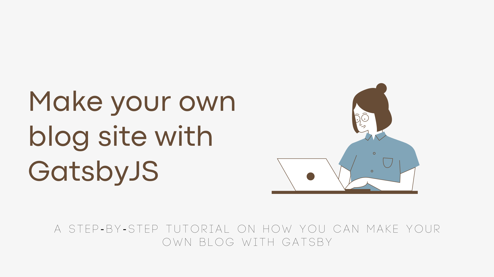
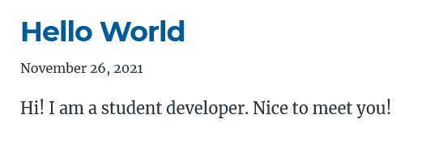

As a part of the #100DaysOfCode challenge, I decided to create a blog to document my journey with the challenge.

This blog is built using GatsbyJS, and I learned the basics of Gatsby in a couple of days. If you know ReactJS, Gatsby is easy to catch on to.

Without further ado, let's dive into how you can develop a blog just like this for sharing your own thoughts and journeys.

## Table of Contents

1. [What is GatsbyJS?](#WhatisGatsbyJS?)
1. [What are starters in Gatsby?](#starters)
1. [System Prerequisites](#prereq)
1. [Developing the site](#develop)

<a name="WhatisGatsbyJS?"></a>

### What is GatsbyJS?

Gatsby is a React-based open-source framework for creating websites and apps.

<a name="starters"></a>

### What are starters in Gatsby?

To develop our blog we will be using the [gatsby-starter-blog starter](https://www.gatsbyjs.com/starters/gatsbyjs/gatsby-starter-blog), but what is a starter?

- It is a boilerplate Gatsby site that helps jump-start the development process.
- Starters are maintained by the community, for the community.

<a name="prereq"></a>

### System Prerequisites

You need to perform the following installations on your system before you begin with the development:

1. [Node.js](https://nodejs.org/en/download/): preferably the LTS version.
1. After you install Node.js, open your terminal or command prompt and install gatsby-cli using npm with the command

`npm install -g gatsby-cli`

1. To facilitate deployment and to make your repository on GitHub, you need to download and install [git](https://git-scm.com/downloads).

#### OR

Use [CodeSandbox](https://codesandbox.io) to develop right from your browser! Creating and setting up the project is significantly easier and hassle-free in a sandbox. [Will not be using this method in this blog.]

We're all set to begin development!

<a name="develop"></a>

### Developing the site

#### Steps to develop

1. [Create a new gatsby project and install the starter](#1)
1. [Run the website locally](#2)
1. [Create a GitHub repository and push the code to the repository](#3)
1. [Change author details in `gatsby-config.js`](#4)
1. [Create your first blog post](#5)

<a name="1"></a>

#### Step 1:

##### Create a new gatsby project and install the starter

1. Using your terminal, navigate to the directory where you want to create the project.
1. To create a new project, we use the `gatsby new` command, we can install the starter in 2 ways:

> 1. `gatsby new {project-name} {starter-repo-link}`
> 1. `gatsby new {project-name} {GithHub_username/repo_name}`

For example, I want to call my project 'my-blog':

> 1.  `gatsby new my-blog https://github.com/gatsbyjs/gatsby-starter-blog`
> 1.  `gatsby new my-blog gatsbyjs/gatsby-starter-blog`

<a name="1"></a>

#### Step 2:

##### Run the website locally

1. Navigate to your project directory in the terminal.
   > `cd my-blog`
1. Install all dependencies using `npm` or `yarn`.

> `\my-blog> npm install`

**OR**

> `\my-blog> yarn`

1. Run `gatsby develop`. The terminal output will look like this.

```js
success open and validate gatsby-configs, load plugins - 7.188s
.
.
.
success extract queries from components - 6.805s
success write out requires - 0.107s
success run page queries - 0.041s - 1/1 24.10/s
⠀
You can now view my-blog in the browser.
⠀
  http://localhost:8000/
⠀
View GraphiQL, an in-browser IDE, to explore your site's data and schema
⠀
  http://localhost:8000/___graphql
⠀
Note that the development build is not optimized.
To create a production build, use gatsby build
⠀
success Building development bundle - 18.418s
success Writing page-data.json files to public directory - 1.640s - 2/3 1.83/s


```

The website will now be accessible at [http://localhost:8000/](http://localhost:8000/). As long as the development server is running, you can view your website here. It automatically recompiles every time you save changes as long as 'gatsby develop' is running.

The GraphiQL interface at [http://localhost:8000/\_\_\_graphql](http://localhost:8000/___graphql).

It is okay if you don't have experience working with GraphQL, I have yet to learn it and it is not needed to build this blog thanks to the starter!

<a name="3"></a>

#### Step 3:

##### Create a GitHub repository and push the code to the repository

1. Navigate to the project directory in the terminal.
1. Run the command `git init` to initialise a local git repository.
1. Run `git add -all` to add all files to git.
1. Run `git commit -m "create initial commit"` to commit these files to the repository.
1. Now, sign in to [GitHub](https://github.com/) and [create a new empty repository](https://docs.github.com/en/get-started/quickstart/create-a-repo). Copy the link to the repo. For example: _https://github.com/SimranMakhija7/blog_
1. In your terminal, in your local repository, run the following command to link to GitHub repo:

`git remote add origin {repo-link}`

Here, replace the {repo-link} with the link copied in the previous step.

1. Push the initial commit to GitHub using the command `git push -u origin main`.

Our repository is now on GitHub! Now let's make some changes so that the blog is ours!

<a name="4"></a>

#### Step 4:

##### Change author details in `gatsby-config.js`

1. Open the file '/my-blog/gatsby-config.js' in your favorite editor. I use VSCode.
1. The file contains a `module.exports` object, within which the `siteMetadata` is there. It should look like this:

```js
siteMetadata: {
   title: `Gatsby Starter Blog`,
   author: {
     name: `Kyle Mathews`,
     summary: `who lives and works in San Francisco building useful things.`,
   },
   description: `A starter blog demonstrating what Gatsby can do.`,
   siteUrl: `https://gatsbystarterblogsource.gatsbyjs.io/`,
   social: {
     twitter: `kylemathews`,
   },
 },
```

Replace with your details, except for `siteUrl` for now, like so:

```js
siteMetadata: {
   title: `Simran's Blog`,
   author: {
     name: `Simran Makhija`,
     summary: `who lives and studies Computer Science in Indore, India.`,
   },
   description: `My blog for sharing all things tech and community, built with GatsbyJS as a part of #100DaysOfCode`,
   siteUrl: `https://gatsbystarterblogsource.gatsbyjs.io/`,
   social: {
     twitter: `justdev_sim`,
   },
 },
```

1. Replace `src/images/profile-pic.png` with your own picture. Make sure the name of the image is `profile-pic.png`.

Now, the blog has your name, title info and image!
The site will now look like this:


<a name="5"></a>

#### Step 5:

##### Create your first blog post

Now, let's take a look at how our blogs are stored and organised.

1. The `content\blog` directory stores all your blog posts.
1. Each blog post has its own subdirectory. The name of this subdirectory corresponds to the route at which the blog will be rendered.

For example: The blog within the `hello-world` folder can be found at _{base-url}/hello-world_ (http://localhost:8000/hello-world on our local server)

1. The `index.md` file contains the markdown source for your blog. The default `hello-world` contains a markdown cheatsheet of sorts that I have stored in a separate file and refer to for syntax.

Now, let's go ahead and write our own first blog.

- Delete all folders within `content/blog`.
- Create a new folder `hello-world`.
- Within this folder, create a new file `index.md`. This is where we'll write our markdown source.
- In the file, add the frontmatter:

```md
---
title: Hello World
date: "2021-11-26T22:00:32.169Z"
description: "Hi! I am a student developer. Nice to meet you!"
---
```

This front matter corresponds to the name, date and blog description we see on the home page like so:


- Below the frontmatter, you can include the entire content of your blog.
  Here's how my `content/blog/hello-world/index.md` looks:

```md
---
title: Hello World
date: "2021-11-26T22:00:32.169Z"
description: "Hi! I am a student developer. Nice to meet you!"
---

Hi! I am **Simran Makhija** 🙋🏻‍♀️ Nice to meet you 🤝
I am a final year **Computer Science & Engineering** student from Indore, India.👩‍💻
....
Thank you for dropping by!🌸
```

- Save all changes and push them to your GitHub repository.

This is it on developing the blog site. Hope it was easy to follow and helpful.

To deploy this blog site to Netlify (for free😉) follow [this step-by-step guide](https://www.netlify.com/blog/2016/02/24/a-step-by-step-guide-gatsby-on-netlify/)!

Thank you for reading! 
