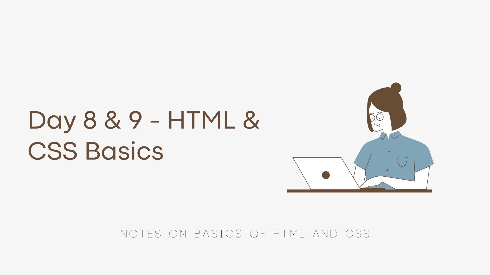

Notes and takeaways from the third lessson of [neogcamp](https://neog.camp) - Creating a component library.

- **Important Note:** *Before you start any web dev project, spend some time on the design process and create a component library wherefrom you can pick components to build your website like you would use lego blocks. This helps in developing faster and also ensures consistency of design.*

- HTML Element: Opening and closing tags + content + attributes.

#### Semantic HTML
- Semantic HTML is also known as POSH: Plain Old Semantic HTML.
- It means using meaningful and correct HTML tags as much as possible.
- This helps improve accessibility of a website. It is accessible HTML. It helps with accessibility shortcuts on the keyboard as well as with screenreaders.
- Eases development process. It also helps with better SEO.

#### Block vs Inline elements in HTML
- **Block Elements:** Elements that appear in a new line from their preceding elements and occupy the entire line. Any element after these will appear in the next line. They take an entire block of screen real-estate. 
*eg:* `h1`,`h2`,`p`,`div` etc.
- **Inline Elements:** Elements that only occupy some area surrounding their content and not an entire block.
*eg:* `small`,`strong`, `a` etc.

#### BEM naming convention
- *BEM stands for Block Element Modifier.* 
- It is a declarative CSS class naming convention. 
- It helps understanding dependencies. 
- A set declarative format helps syncronise across teams. 
**Example:**
- `Block` : button -> .btn
- `Element`:  submit button -> .btn-submit
- `Modifier`: disabled submit button -> .btn-submit-disabled

The [BEM 101 post on CSS Tricks](https://css-tricks.com/bem-101/) has a complete explanation of how and why this works.

Thanks for reading! ✨
