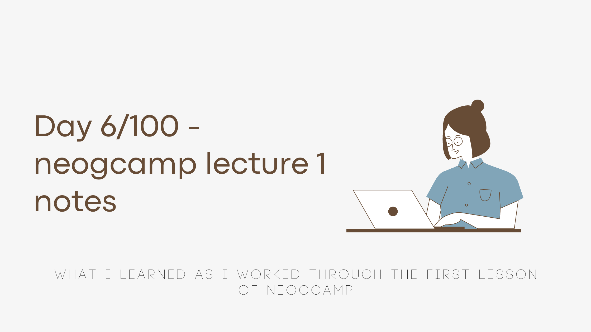

As I started with my #100DaysOfCodeChallenge, I realised how when I had initially started to learn webdev, it was very fast paced & I felt the need to go back to the basics. So I decided to start with [neogcamp](https://neog.camp/) Level Zero lectures to strengthen my fundamentals.

I worked through [Lecture 1](https://neog.camp/guide/lesson-one) today and here's my notes/takeaways from it.

#### What is the difference between parameters and arguments of a function?
**Parameters:** The variable names we use to represent the input values when defining a function.

**Arguments :** The values that are passed as inputs to a function when the function is called.

#### How do we read user input using JavaScript?
**In the browser :** Using the `prompt()` method. 
- The prompt method has 2 optional parameters a `question` and a `default` value.
- It causes the browser to display a dialog box with the optional `question` and an input field.
- Returns the value entered by user.

**In a CLI application :** Using the `readline-sync` npm library.
- Imported into a js script as `var readlineSync = require("readline-sync")`.
- Faciliates reading text input from the command line with the `readlineSync.question(query)` method. The query parameter is the question displayed to prompt user input.

#### Other functions of ['readline-sync'](https://www.npmjs.com/package/readline-sync) library 
1. `question`    -> Displays the `query` string prompting text input from user. Returns input text.
1. `keyInYN`     -> If input is 'Y' or 'y', returns `true`. For any other character input, returns `false`.
1. `keyInSelect` -> `keyInSelect(list, query)` Options from the `list` parameter are displayed with 1-based indexing. Input between 1 to list length are accepted and the index of the list item is returned.
1. `keyIn`       -> Records character entered.
1. `promptCLLoop`-> `promptCLLoop(obj)` Allows you to simulate an interactive shell interface. The input `obj` object contains commands as keys and values contain functions to be performed corresponding to those commands. 

#### ['chalk'](https://www.npmjs.com/package/chalk) package
This is a cool library that lets you style your terminal, make it pretty and colorful. It is fairly easy to use. 
While trying to import this in my js script, I learned that it cannot be imported using the `require()` syntax and the `import` syntax cannot be used in CommonJs. And so I actually learned for the first time what CommonJs is.

[This stackoverflow discussion](https://stackoverflow.com/questions/57492546/what-is-the-difference-between-js-and-mjs-files) has a nice explanation of the differences between a CommonJs module and an ES6 module.

Also, here's my [repl](https://replit.com/@SimranMakhija7/neogcamp-lec-1?v=1) of the lecture exercises. I had fun doing these.

These are my notes and learnings from the first lecture! Thanks for reading ✨
