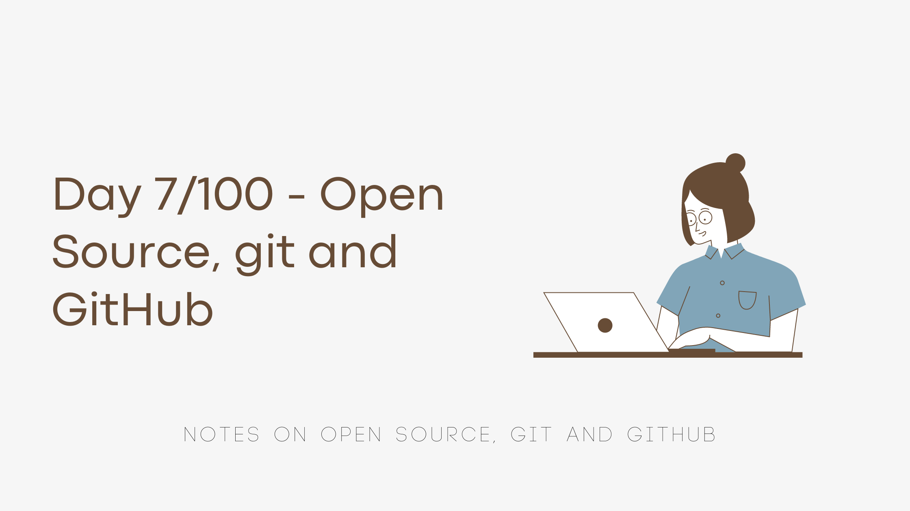
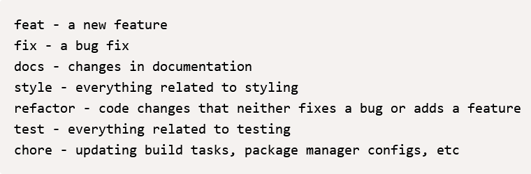

I worked through [Lecture 2](https://neog.camp/guide/lesson-two) of [neogcamp](https://neog.camp/) today and here are my notes/takeaways from it. 

Since, I do know some basics and fundamentals, so I skipped parts of the video as suggested and I tried to do the exercises and dig deeper into the homework assignments.

#### Explain git to me like I'm 10

*I have a 10 year old cousin that plays Minecraft and this is how I would explain this to him.*

When you play Minecraft, sometimes when you try to add something new to your house, the house gets damaged or burns down, this happens right?
What if you had your house's older version sitting somewhere and you could see your changes and undo them or see *exactly* where you made a mistake that caused it to burn?
This is what git does, it keeps track of all your changes to a file (house) and you can look at them at anytime to see what broke your code (burned your house) or you can restore an older working version (an undamaged house).

#### What is Open Source? (As per [opensource.org](https://opensource.org/osd))

A software is an open-source software if they allow it to be freely used, modified and shared, not if just the source code is publicly available.

The term "open source software" is interchangeably used with "free software". The two terms essentially mean the same thing. The latter is an older term. We also often hear the term `FOSS`. This stands for "Free and Open Source Software".

#### What is an Open Source License?
- Legal and binding contract between the author and the user of the open source software. It enumerates the conditions and terms under which the user may access, modify and share the software.
- The license is what declares the software as Open Source. Without an Open Source License, publicly available source code is unusable by anyone other than the author of the software. 
- These are sometimes divided into copyleft and permissive based on requirements and restrictions placed on users.
- Some Popular Licenses : GNU General Public License, MIT License

#### What happens when we commit our code?
The changes that we have made since the last commit, are stored in the latest commit. A commit can be reversed but now all these changes are bundled together and this 'version' of our repository is now stored.

#### How to write good commit messages?
As given in the guide, a good commit message starts with "what type of change has been made" followed by a brief description.

Types of changes can be as per the following [screenshot from the guide]

**My solutions to the *live* exercise:**

Q. What would you put as a commit message if:

1. You added some details to the README.md file?
    `docs: details added to README.md`
1. Your CLI app was taking "potato" as an input for leap year test?
    `fix: fix leapYearCheck() function`
1. You started using CHALK library in your CLI app?
    `style: use CHALK library in CLI App`
1. You added level based game play in your CLI app?
    `feat: Add level based gameplay`
1. You renamed your variables from var a to var questions?
    `refactor: rename variable`

#### What is a good branch name?
`your-name/feature`

On Netlify, as soon as we create a PR on the repo it generates a preview ✨

Thanks for reading ✨