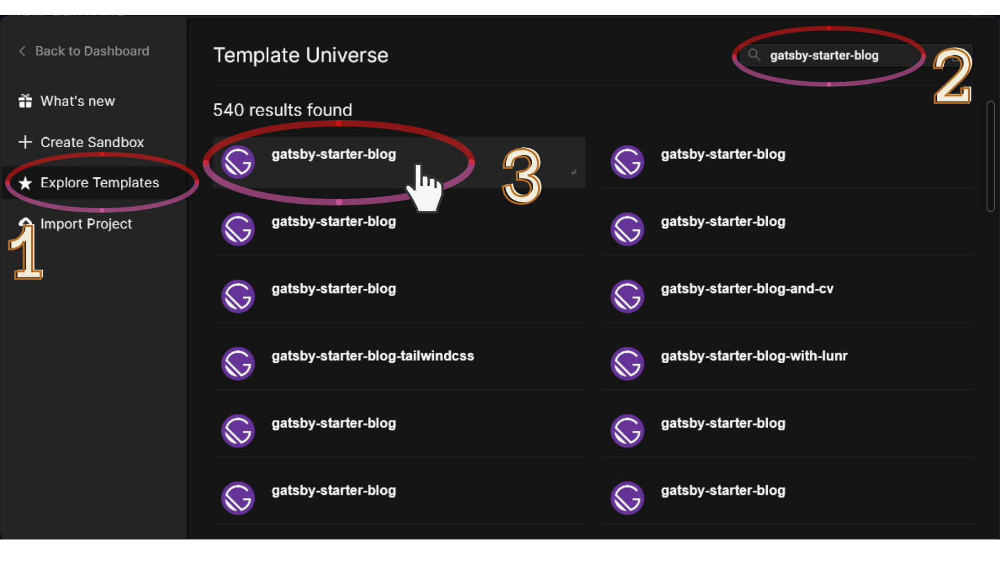
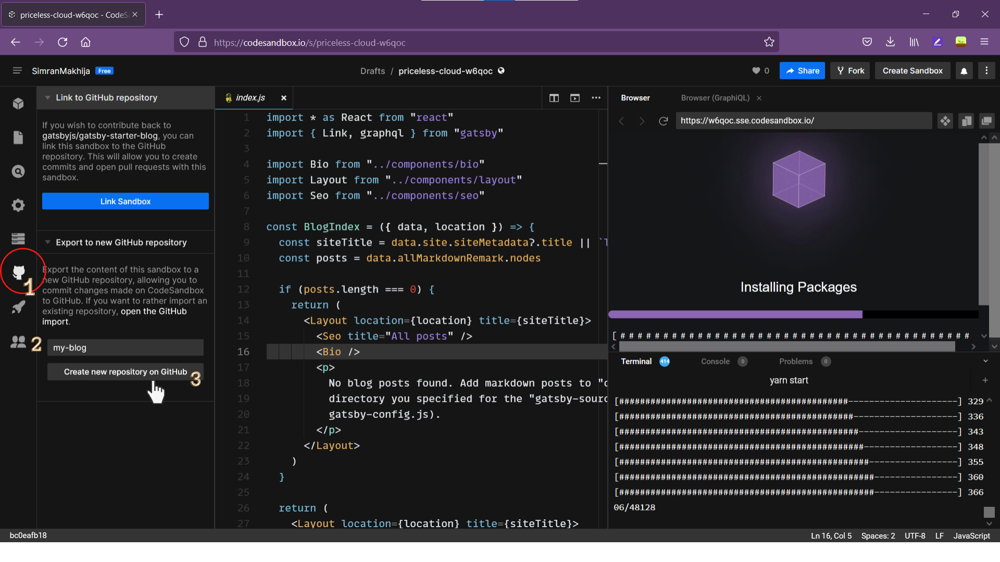

#### Step 1: Create a new gatsby project and install the starter

##### In CodeSandbox

1. Create an account using GitHub or Login at [CodeSandbox](https://codesandbox.io).
1. Click the blue **Create Sandbox** button on the top right and a modal pops up.
   
1. In the left pane, choose Explore Templates. In the search box, type _gatsby-starter-blog_. Click on the "gatsby-starter-blog" result as in the screenshot below:
   
1. Create GitHub repo
   
